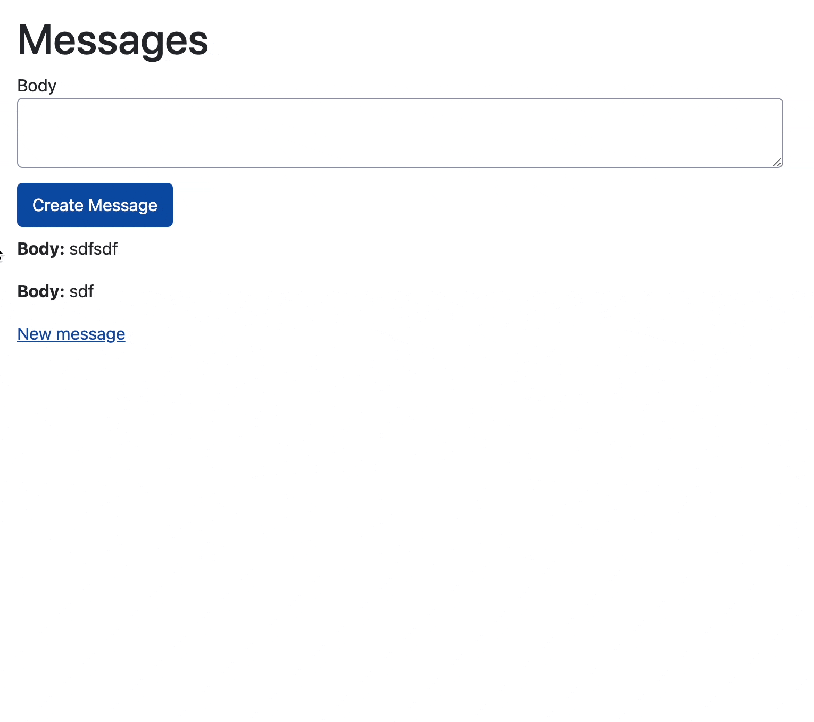

A simple app demonstrating a message index view with form that allows the view to update using turbo stream, which allows only certain elements to update (rather than whole page reload). 

See the [diff between a new rails app with messages scaffold](https://github.com/stevecondylios/turbotest/compare/f5e5908691cc36465dbc0db52483126265d7348c...ed806a4574cd6824d2b288f6dd280dfc48ea67c8)

Based on the first 10-15 minutes of [this](https://www.youtube.com/watch?v=csvaYIaBYpw&list=PLdTytUiloS16epXsqHswpCUMND_rksjr4) superb tutorial. 

More info on turbo streams and its methods here: https://turbo.hotwired.dev/handbook/streams

Start app with `bin/dev`

Visit: http://localhost:3000/messages

